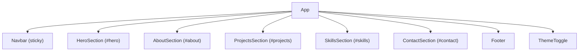

# Portfolio project plan

## Table of Contents
1. Executive Summary
2. Goals, Objectives, and Success Metrics
3. Scope
4. Personas and Key User Journeys
5. Information Architecture and Site Map

## Executive Summary
This project will deliver a modern, responsive, and visually appealing developer portfolio website to showcase projects, skills, and contact information. The solution will use a React-based frontend (Create React App baseline) with a one-page layout and smooth-scrolling sticky navigation. The Ocean Professional theme will guide visual language, emphasizing clarity, legibility, and subtle gradients. We will prioritize accessibility (WCAG 2.1 AA), Core Web Vitals performance, and secure frontend practices. The plan outlines scope, architecture, milestones, risks, and an implementation roadmap to achieve a production-ready site in four weeks.

## Goals, Objectives, and Success Metrics
The primary goal is to provide a professional online presence for a developer that communicates capabilities and makes it easy for prospective collaborators and recruiters to evaluate work and reach out.

Objectives:
- Present a curated set of projects with concise descriptions, tech stacks, and links.
- Transparently list skills with competency indicators.
- Provide an accessible contact entry point.
- Maintain fast loading and smooth interactions across devices.

Success Metrics:
- Performance: Lighthouse Performance score ≥ 95 on desktop and ≥ 90 on mobile.
- Accessibility: Lighthouse Accessibility score ≥ 95; WCAG 2.1 AA checks pass key criteria.
- Engagement: ≥ 60% visitors scroll beyond the fold and engage with at least one section.
- Reliability: 99.9% uptime of static hosting environment (post-deploy).

## Scope
### In-Scope
- React-based single-page site with sections: Hero, About, Projects, Skills, and Contact.
- Sticky navigation with smooth scrolling and active link highlighting.
- Responsive layout optimized for mobile, tablet, and desktop.
- Theming aligned to Ocean Professional color system and typography.
- Basic in-page state (theme toggle, nav state, section intersection observers).
- Environment-driven configuration for external links and feature flags.
- Basic analytics hook placeholder (respecting privacy and opt-in).
- Unit tests for key components and integration tests for navigation and section visibility.

## Personas and Key User Journeys
Personas:
- Hiring Manager: Scans projects and skills quickly, wants credibility signals and easy contact.
- Technical Recruiter: Skims highlights, needs concise project summaries and simple contact path.
- Peer Developer: Looks for deeper technical detail and source links.
- Potential Client: Focuses on portfolio visuals, testimonials (future), and contact CTA.

Key Journeys:
- Landing to Projects: User lands on Hero, uses sticky nav to jump to Projects, opens a project detail modal or external repo/demo link, then proceeds to Contact.
- Landing to Contact: User scans Hero and About, jumps to Contact to send a message via configured endpoint.
- Mobile-First Scan: User scrolls sequentially, nav highlights current section, CTA buttons provide quick jumps and actions.

## Information Architecture and Site Map
Information Architecture:
- Global Navigation: Hero, About, Projects, Skills, Contact.
- Content Hierarchy: Hero (identity and CTA), About (bio and values), Projects (cards with tech tags and links), Skills (grouped by category), Contact (form or links).

Site Map:
- / (single-page application)
  - #hero
  - #about
  - #projects
  - #skills
  - #contact

## UI/UX Design Approach (Ocean Professional Theme)
The Ocean Professional theme employs a modern aesthetic with blue primary and amber secondary accents. We will use a clean layout with generous white space, rounded corners, and subtle elevation via shadows. The background will use a light neutral (#f9fafb) with white surfaces (#ffffff), balanced by accessible text (#111827). Interactive elements use primary #2563EB; secondary #F59E0B accents for callouts. Subtle gradients such as from-blue-500/10 to-gray-50 provide depth. Motion is modest: smooth scroll, hover/active transitions, and section reveal with reduced-motion preferences respected.

Typography emphasizes readability with large, clear headings in the Hero and consistent hierarchy across sections. Controls include accessible contrast and focus rings. The existing theme toggle pattern in App.js will be preserved and refined to align light/dark adjustments while meeting contrast ratios.

## Technical Architecture (React Frontend)
The frontend is a React application created with Create React App (CRA). The current baseline includes:
- Entry: src/index.js rendering <App />.
- Application container: src/App.js using React hooks and a data-theme attribute on documentElement for light/dark theme toggling.
- Styling: src/App.css defines CSS variables for light/dark themes and component styles.
- Tests: src/App.test.js uses React Testing Library.

We will extend this with:
- Modular component structure for sections.
- Layout and navigation components.
- Utilities for environment configuration and feature flags.
- Optional routing abstraction while remaining a one-page scroll site (React Router is not required for anchor navigation; we will implement in-page navigation with smooth scrolling).

High-Level Diagram:
- App
  - Navbar (sticky)
  - HeroSection
  - AboutSection
  - ProjectsSection
  - SkillsSection
  - ContactSection
  - Footer
  - ThemeToggle (existing behavior retained)

## Component Breakdown and Responsibilities
- App: Top-level composition, theme management, section registration for intersection observers, and global context providers.
- Navbar: Sticky header, logo/brand, section links with active state based on scroll position.
- Section Wrapper: Shared component to handle id anchors, spacing, accessible headings, and intersection observer callbacks.
- HeroSection: Identity, short pitch, CTA buttons (View Projects, Contact).
- AboutSection: Bio, values, timeline or summary of experience.
- ProjectsSection: Grid of cards (title, description, tech badges, links). Optional modal or external link actions.
- SkillsSection: Categorized skills (languages, frameworks, tooling) with simple proficiency indicators.
- ContactSection: Contact form (name, email, message) wired to REACT_APP_BACKEND_URL or external service; fallback to mailto link from environment when backend is not configured.
- Footer: Copyright, social links.
- ThemeToggle: Button already present, aligned with UI design tokens.
- Utilities:
  - env.js: Safe read of REACT_APP_* variables with defaults and validation.
  - scroll.js: Smooth scroll helper and focus management.
  - analytics.js: Placeholder for privacy-respecting analytics events.

## Routing and Sections
The site is a single page with anchor-based navigation:
- Sections: hero, about, projects, skills, contact.
- The Navbar will implement smooth scroll to anchors, update active link via intersection observer, and maintain focus management for accessibility. React Router is not planned for MVP; if future multi-page needs emerge, it can be introduced with minimal refactor.

## State Management and Data Strategy
Local UI State:
- Theme (light/dark) via React useState in App and persisted via prefers-color-scheme or localStorage if enabled by a feature flag.
- Navigation active section via intersection observer in App or a NavContext.
- Form state (contact) managed locally with validation (required fields, email format).

Data Strategy:
- Projects and skills can be defined as local JSON or constants in src/data for MVP. A feature flag can enable remote fetching in future.
- No sensitive data is stored in the frontend. External endpoints are configured via environment variables.

## Environment and Configuration
Environment variables (used in frontend; values prefixed with REACT_APP_):
- REACT_APP_API_BASE: Base URL for any API calls (optional; default empty).
- REACT_APP_BACKEND_URL: Endpoint for contact form submission (optional; if missing, show mailto fallback).
- REACT_APP_FRONTEND_URL: Canonical site URL for metadata and sharing.
- REACT_APP_WS_URL: Not used in MVP; reserved for future real-time features.
- REACT_APP_NODE_ENV: Environment indicator; defaults to development in local.
- REACT_APP_NEXT_TELEMETRY_DISABLED: Set to true to disable telemetry if applicable; CRA typically does not use it, retained for consistency.
- REACT_APP_ENABLE_SOURCE_MAPS: Controls source map generation.
- REACT_APP_PORT: Port for local dev (if supported by tooling).
- REACT_APP_TRUST_PROXY: Not used by CRA directly; reserved for future use.
- REACT_APP_LOG_LEVEL: Controls client-side log verbosity (error, warn, info, debug).
- REACT_APP_HEALTHCHECK_PATH: Optional path for uptime checks (e.g., /health on static host via redirect/mock).
- REACT_APP_FEATURE_FLAGS: JSON or CSV string enabling features (e.g., themePersistence, analytics).
- REACT_APP_EXPERIMENTS_ENABLED: Feature toggle for experimental UI.

Defaults and Usage:
- Safe reading via a small env utility that returns typed values with sensible defaults (e.g., empty strings for URLs, false for flags).
- No secrets or tokens should be embedded in the frontend code or environment.

## Accessibility and Performance Targets
Accessibility (WCAG 2.1 AA):
- Color contrast ratios ≥ 4.5:1 for normal text; ≥ 3:1 for large text and UI components.
- Keyboard navigability for all interactive elements; visible focus states.
- aria-labels and roles for non-semantic elements, alt text for images (e.g., logo).
- Reduced motion respect for prefers-reduced-motion in animations and smooth scrolling fallbacks.
- Proper landmark roles (header, nav, main, footer), headings structure (H1 to H3), and skip-to-content link.

Performance:
- Optimize Core Web Vitals: LCP < 2.5s, CLS < 0.1, INP < 200ms on a mid-tier mobile device/network.
- Lightweight dependencies (current project uses only react, react-dom, react-scripts).
- Image optimization via modern formats and responsive sizes.
- Code splitting is minimal for SPA; ensure lazy loading only if sections become heavy.
- Use CSS variables and minimal runtime computation in render paths.

## Security Practices (Frontend)
- No secrets in code or env baked into client as sensitive values; treat all REACT_APP_* as public.
- Sanitize and validate all form inputs on the client; do not trust client validation alone.
- Use HTTPS for all endpoints; block mixed content.
- Implement Content Security Policy (via hosting config) to reduce XSS risk.
- Avoid inline event handlers and use React’s synthetic events.
- Log sparingly and never log PII.
- Respect user privacy: provide opt-in for analytics if added later.

## Backlog and Milestones (Weeks 1–4)
Week 1: Foundations and IA
- Define IA, site map, and content inventory.
- Implement base layout (App, Navbar, SectionWrapper).
- Set up theme system (extend existing App.css variables for Ocean Professional).
- Establish environment utility and feature flags.
- Add basic Hero and About sections.

Week 2: Core Content and Navigation
- Build ProjectsSection (cards, tags, external links).
- Build SkillsSection (categories, badges).
- Implement sticky nav with smooth scroll and active section highlighting.
- Add unit tests for components and integration tests for navigation behavior.

Week 3: Contact, Accessibility, and Performance
- Implement ContactSection with environment-based submission; fallback to mailto if REACT_APP_BACKEND_URL absent.
- Accessibility pass: keyboard nav, focus management, ARIA labels, color contrast.
- Performance tuning: image optimization, code cleanup, Lighthouse checks.
- Visual QA across breakpoints.

Week 4: Hardening and Release
- Final refinements to copy and content.
- Add analytics placeholder (feature-flagged).
- Documentation updates (README, architecture notes).
- Final test suite run and fix, prepare production build, deployment guide.

## Testing Strategy (High-Level)
- Unit Tests: Component rendering, props handling, and interaction tests using React Testing Library and Jest (extend existing App.test.js).
- Integration Tests: Smooth scroll navigation, active link updates, and contact form validation.
- Visual Checks: Manual visual regression checks across common device sizes; consider adding a screenshot diff tool later.
- Accessibility Checks: Automated linting and Lighthouse a11y audits; keyboard-only manual runs.

## Risks, Assumptions, and Mitigations
Risks:
- Scope creep with animations or dynamic content.
- External endpoint availability for contact form.
- Performance regressions from heavy media.

Mitigations:
- Strict MVP scope; advanced animations behind feature flags.
- Provide mailto fallback for contact if backend URL missing.
- Optimize media assets and defer non-critical loading.

Assumptions:
- Static hosting environment supports HTTPS and CSP configuration.
- No backend changes required for MVP.

## Acceptance Criteria and Definition of Done
Acceptance Criteria:
- Sections implemented: Hero, About, Projects, Skills, Contact with functional sticky nav and smooth scroll.
- Theming conforms to Ocean Professional palette with accessible contrast.
- Contact path available (API or mailto fallback) and validated on client.
- Performance and accessibility meet targets stated in this plan.

Definition of Done:
- Code merged to main branch with passing unit and integration tests.
- Lighthouse scores meeting thresholds.
- A11y checks completed; keyboard-only navigation confirmed.
- Documentation updated (README, environment configuration, and this plan).
- Production build generated and preview deployed successfully.

## Implementation Roadmap and Next Steps
- Set up project structure for components, data, and utilities while preserving current CRA baseline:
  - src/components/{layout,sections,shared}
  - src/data/{projects.js,skills.js}
  - src/utils/{env.js,scroll.js,analytics.js}
- Implement Navbar and SectionWrapper with intersection observer handling.
- Build each section sequentially with responsive design and a11y in mind.
- Wire environment variables via env utility; populate .env.example for developer onboarding.
- Add tests incrementally alongside components.
- Perform a Lighthouse/a11y sweep and tune styles.
- Prepare deployment documentation for static hosting.

### Mermaid Diagram: Section Composition

### Notes on Current Repository Alignment
- The existing App.js implements a theme toggle via data-theme on documentElement and is compatible with the planned design system.
- App.css defines CSS variables for theme control and provides a strong base for Ocean Professional styling.
- No router exists; the plan maintains anchor-based scrolling for MVP, avoiding additional dependencies.

